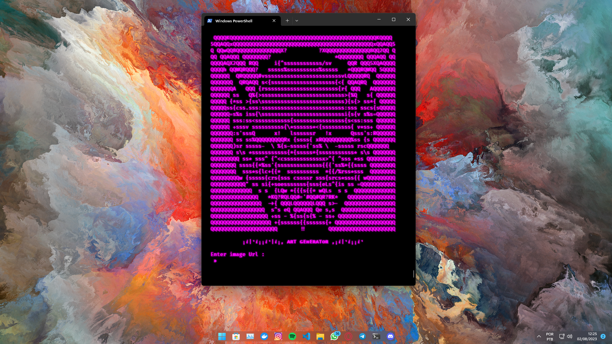
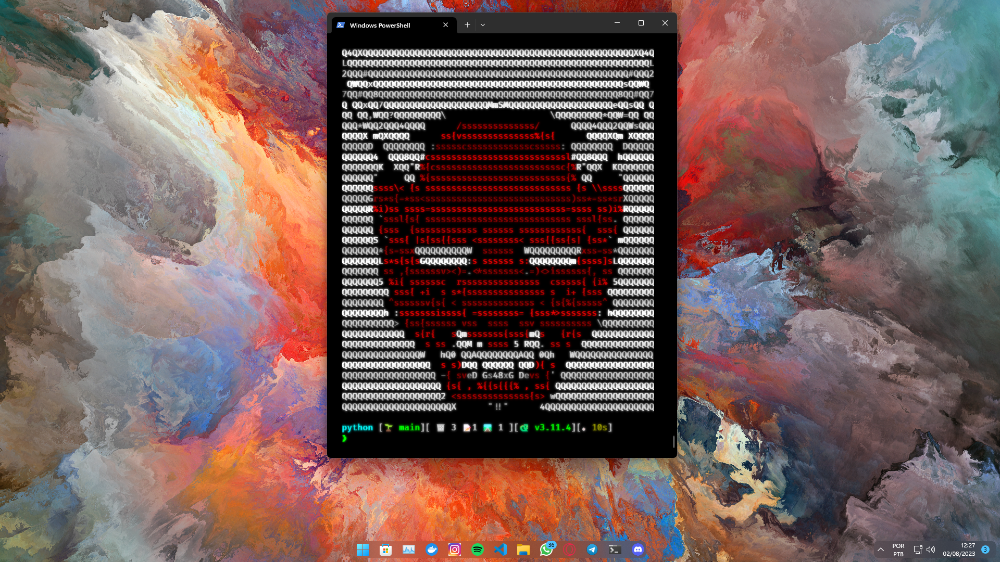

<h1 align="center">
  <br>
  <br>
  ART GENERATOR
  <br>

</h1>
  <h4 align="center">   Art Generator is a tool built in Python to generate image strings in <a href="https://www.google.com/url?sa=t&rct=j&q=&esrc=s&source=web&cd=&cad=rja&uact=8&ved=2ahUKEwil4I-eqb6AAxVVnpUCHS62A0cQFnoECBIQAQ&url=https%3A%2F%2Fpt.wikipedia.org%2Fwiki%2FASCII&usg=AOvVaw2mLC6PbrBrqdjTUB7gLKsg&opi=89978449">Ascii</a> format. </h4>
<br>

## Examples 
<br>


<h3 align="center">Set Image Url  </h3>




<h3 align="center">Desactivate Monochrome State (with colors or default) : </h3>


<h3 align="center">set how many columns you want to output  </h3>


<h3 align="center">OUTPUT  </h3>




## How To Use

```bash
# Clone this repository
$ git clone https://github.com/arisonreis/Arte-Generator

# Go into the repository
$ cd Arte-Generator

# Run the app
$ python3 art-generator.py
```